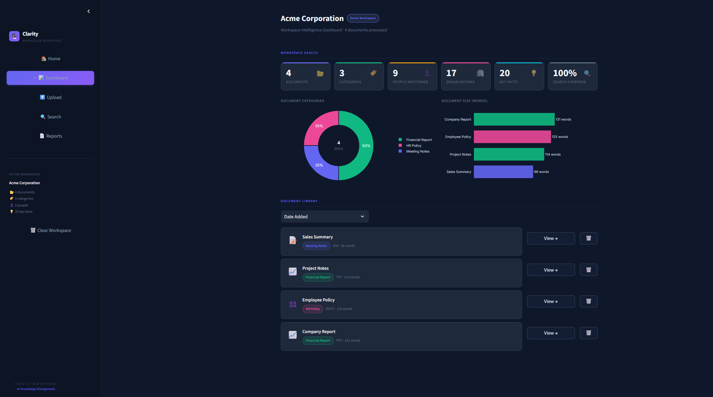
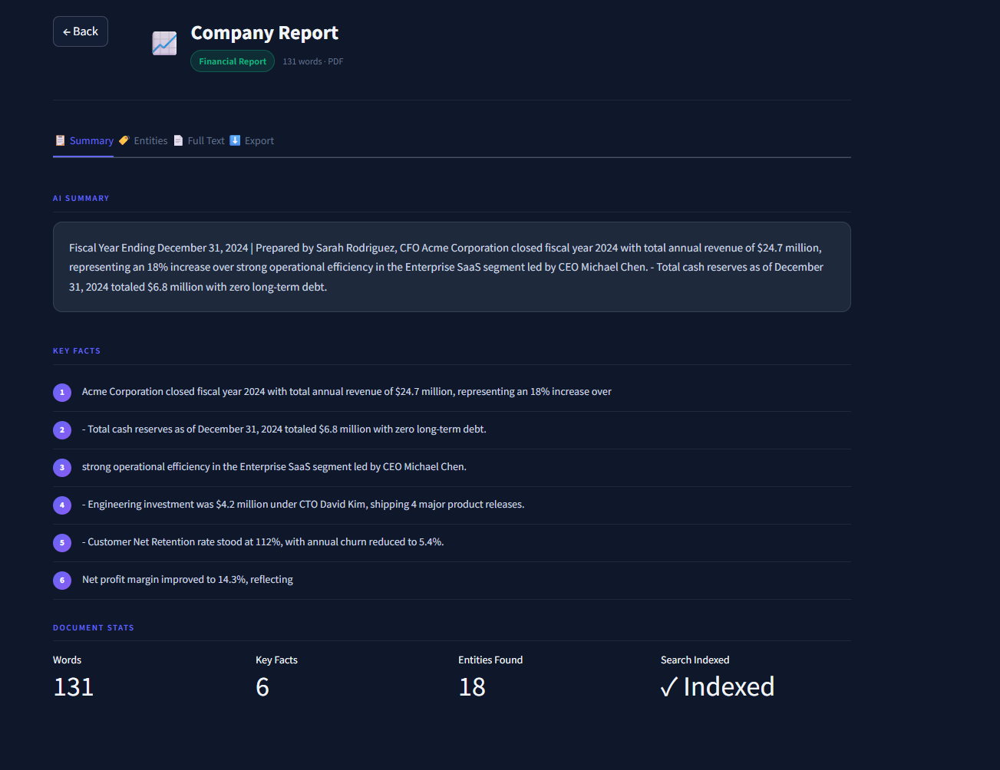
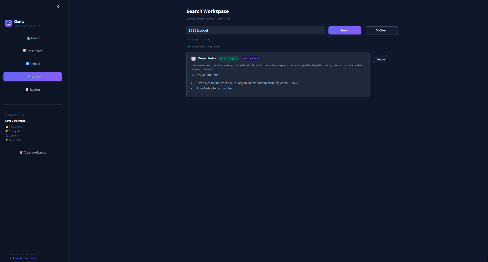
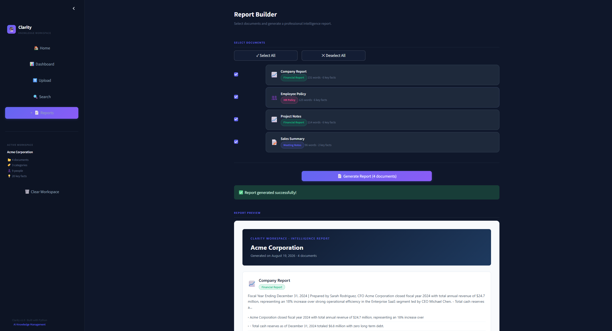

# Clarity — AI Knowledge Workspace

> **Transform unstructured business documents into an organized, searchable intelligence workspace.**

[](https://github.com/HARIHRITHIK/clarity-ai-knowledge-workspace/actions)
[](https://clarity-ai-knowledge-workspace-ctubssksgzly4wrfbcz6pn.streamlit.app/)
[](https://python.org)
[](LICENSE)

[**⚡ 2-Minute Demo Guide**](DEMO.md) • [**🏛️ System Architecture**](docs/ARCHITECTURE.md) • [**📁 Sample Corpus**](sample_data/)

---

## 🚀 Live Demo

> 🔗 **Public URL:** [https://clarity-ai-knowledge-workspace-ctubssksgzly4wrfbcz6pn.streamlit.app/](https://clarity-ai-knowledge-workspace-ctubssksgzly4wrfbcz6pn.streamlit.app/)

Click the link above or the badge to open the live application deployed on Streamlit Community Cloud.

---

## 📸 Application Preview

| **Workspace Dashboard & Analytics** | **Document Intelligence & Entity NER** |
|:---:|:---:|
|  |  |

| **Natural Language Semantic Search** | **Executive HTML Report Builder** |
|:---:|:---:|
|  |  |

---

## 📌 Problem

Organizations accumulate thousands of unstructured PDF reports, contracts, meeting notes, and spreadsheets. Retrieving actionable context typically involves:
* Manually reading through lengthy multi-page files.
* Keyword search tools that miss semantic synonyms and intent.
* Maintaining internal wikis that quickly become outdated.
* Relying on tribal knowledge across disconnected teams.

---

## 💡 Solution

**Clarity** is an offline-first document intelligence system. When documents are ingested, Clarity automatically parses text across multiple file formats, classifies domain categories, generates extractive summaries, extracts structured named entities, builds a semantic search index, and exports executive HTML reports—all running locally on CPU with zero external API dependencies.

```
Documents ➔ Text Extraction ➔ Classification ➔ Summarization ➔ NER ➔ Semantic Search ➔ Workspace ➔ Executive Report
```

---

## ✨ Key Features

* **📊 Workspace Health Dashboard**: Real-time aggregated intelligence panel showing total documents, auto-detected categories, unique entities, and interactive Plotly distribution charts.
* **🤖 Automated 5-Stage NLP Pipeline**: Sequentially transforms raw files into structured knowledge with per-stage progress feedback.
* **🔍 Semantic Search Engine**: Natural language query search with cosine similarity relevance scoring and **High / Medium / Low** confidence indicators.
* **📑 Entity Extraction & Fact Mining**: Identifies people, organizations, dates, currency amounts, and locations with frequency counts.
* **📄 Executive Report Builder**: Select any combination of documents to compile and export a standalone, print-ready, XSS-sanitized HTML executive report.
* **🚀 Instant Demo Workspace**: Pre-bundled multi-format enterprise dataset allowing instant evaluation in under 30 seconds.

---

## 📁 Supported Formats

| Format | Extension | Processing Engine | Capabilities |
|---|:---:|---|---|
| **PDF** | `.pdf` | `pypdf` | Multi-page text extraction |
| **Word Document** | `.docx` | `python-docx` | Headings, paragraphs, table cells |
| **Plain Text** | `.txt` | Python Standard Library | Multi-encoding support (`utf-8`, `latin-1`, `cp1252`) |
| **Tabular Data** | `.csv` | `pandas` | Column-structured record serialization |

---

## ⚙️ 5-Stage NLP Pipeline

Every document passes through an isolated 5-stage transformation pipeline:

1. **Stage 1: Text Extraction** — Dispatches file bytes to the appropriate format processor using an Abstract Factory pattern (`BaseProcessor`).
2. **Stage 2: Domain Classification** — Computes TF-IDF keyword frequency vectors to categorize the document (e.g. *Financial Report*, *HR Policy*, *Contract / Legal*).
3. **Stage 3: Extractive Summarization** — Ranks sentences via TF-IDF term saliency scoring to generate a factual 4-sentence summary and key statements.
4. **Stage 4: Named Entity Recognition** — Extracts structured entities (`PERSON`, `ORG`, `DATE`, `MONEY`, `GPE`) using spaCy with regex fallback patterns.
5. **Stage 5: Semantic Indexing** — Computes dense vector embeddings using `sentence-transformers` (`all-MiniLM-L6-v2`) for vector space search.

---

## 🏛️ Architecture

```
                 ┌────────────────────────────────┐
                 │  Multi-Format Document Input   │
                 │   PDF / DOCX / TXT / CSV       │
                 └───────────────┬────────────────┘
                                 │
                                 ▼
                 ┌────────────────────────────────┐
                 │ Stage 1: Text Extraction       │
                 │ (Abstract Factory Processors)  │
                 └───────────────┬────────────────┘
                                 │
                                 ▼
                 ┌────────────────────────────────┐
                 │ Stage 2: Domain Classifier     │
                 │ (TF-IDF Keyword Frequency)     │
                 └───────────────┬────────────────┘
                                 │
                 ┌───────────────┴───────────────┐
                 ▼                               ▼
  ┌─────────────────────────────┐ ┌─────────────────────────────┐
  │ Stage 3: Extractive Summary │ │ Stage 4: Entity Recognition │
  │ (TF-IDF Sentence Saliency)  │ │ (spaCy NER + Regex)         │
  └──────────────┬──────────────┘ └──────────────┬──────────────┘
                 │                               │
                 └───────────────┬───────────────┘
                                 │
                                 ▼
                 ┌────────────────────────────────┐
                 │ Stage 5: Semantic Indexing     │
                 │ (Vector Embedding + TF-IDF)    │
                 └───────────────┬────────────────┘
                                 │
                                 ▼
                 ┌────────────────────────────────┐
                 │ Core Workspace Repository      │
                 │ (Progressively Hydrated Model) │
                 └───────────────┬────────────────┘
                                 │
                 ┌───────────────┴───────────────┐
                 ▼                               ▼
  ┌─────────────────────────────┐ ┌─────────────────────────────┐
  │ Interactive Dashboard &     │ │ Standalone HTML Report      │
  │ Semantic Search Interface   │ │ Generator (Print-Ready)     │
  └─────────────────────────────┘ └─────────────────────────────┘
```

---

## 🧠 NLP Techniques

* **Extractive Summarization**: Scores sentences based on normalized TF-IDF word saliency within the document. Selecting sentences directly from the source text guarantees factual determinism and avoids generative hallucinations.
* **Named Entity Recognition (NER)**: Leverages spaCy's `en_core_web_sm` statistical pipeline to extract domain entities, supplemented by deterministic regex patterns for monetary values and dates.
* **Vector Space Embeddings**: Computes 384-dimensional dense semantic vectors using `sentence-transformers/all-MiniLM-L6-v2` for cross-document query matching.

---

## 🔍 Semantic Search

The search engine compares the vector embedding of a natural language query against stored document embeddings using **Cosine Similarity**:

$$\text{Cosine Similarity} = \frac{\mathbf{u} \cdot \mathbf{v}}{\|\mathbf{u}\| \|\mathbf{v}\|}$$

* **Confidence Thresholds**:
  * **High Confidence**: Similarity Score $\ge 0.65$
  * **Medium Confidence**: Similarity Score $\ge 0.40$
  * **Low Confidence**: Similarity Score $< 0.40$

---

## 🛡️ Fallback Strategy

To ensure zero-crash reliability on low-resource CPU environments:
* **Dense Embedding Fallback**: If `sentence-transformers` model weights are unavailable or fail to load, search automatically falls back to **TF-IDF sparse vector cosine similarity**.
* **NER Fallback**: If spaCy's model is not initialized, entity extraction defaults to high-precision regular expression extractors for currency, dates, and capitalized entity patterns.
* **Encoding Fallback**: Text file parsers attempt `utf-8`, followed by `latin-1` and `cp1252` before raising an error.

---

## 🛠️ Technology Stack

| Layer | Technology | Purpose |
|---|---|---|
| **Language** | Python 3.10 / 3.11 | Core application logic |
| **UI Framework** | Streamlit 1.39+ | Interactive web interface |
| **Vector Embeddings** | `sentence-transformers` (`all-MiniLM-L6-v2`) | Semantic search vectorization |
| **Entity Extraction** | `spaCy` (`en_core_web_sm`) | Statistical named entity recognition |
| **Text Analytics** | `scikit-learn` | TF-IDF vectorization and sentence scoring |
| **Document Parsers** | `pypdf`, `python-docx`, `pandas` | Multi-format file ingestion |
| **Visualizations** | `plotly` | Interactive dashboard charts |
| **Testing & CI** | `pytest`, `pytest-cov`, GitHub Actions | Automated test suite and CI workflow |

---

## 🧪 Testing

The project includes an automated test suite covering all critical business paths:
* File processors (PDF, DOCX, TXT, CSV text extraction and error boundaries)
* Classification, summarization, entity extraction, and semantic search
* 5-stage pipeline orchestration and error propagation
* HTML report generation and XSS escaping

Run the test suite locally:
```bash
pytest -v
```

---

## 📊 Benchmarking

A reproducible performance benchmark script is included in `scripts/benchmark.py` to evaluate pipeline throughput and search latency across the bundled sample corpus.

```bash
python scripts/benchmark.py
```

*Note: Benchmark throughput depends on the host CPU architecture and memory bandwidth.*

---

## 🚀 Deployment

### Local Setup
```bash
# 1. Clone repository
git clone https://github.com/HARIHRITHIK/clarity-ai-knowledge-workspace.git
cd clarity-ai-knowledge-workspace

# 2. Set up virtual environment
python -m venv venv
# Windows: venv\Scripts\activate | Unix: source venv/bin/activate

# 3. Install dependencies & spaCy language model
pip install -r requirements.txt
python -m spacy download en_core_web_sm

# 4. Launch application
streamlit run app.py
```

---

## ⚠️ Limitations

* **In-Memory Storage**: Workspace data is managed in-memory per user session; refreshing the browser resets the active workspace.
* **Single-Node Execution**: Ingestion runs synchronously on CPU without distributed task queues (e.g. Celery).
* **Scanned PDF Text**: Relies on direct text extraction; scanned image-only PDFs without an OCR layer are not parsed.

---

## 🔮 Future Improvements

* **v1.1**: Persistent SQLite / PostgreSQL database integration for multi-session workspace storage.
* **v1.2**: Asynchronous background document ingestion queue with worker processes.
* **v1.3**: Tesseract OCR support for scanned PDF and image ingestion.
* **v1.4**: Document comparison and diff visualization between contract versions.

---

## 📜 License

This project is licensed under the MIT License — see the [LICENSE](LICENSE) file for details.
